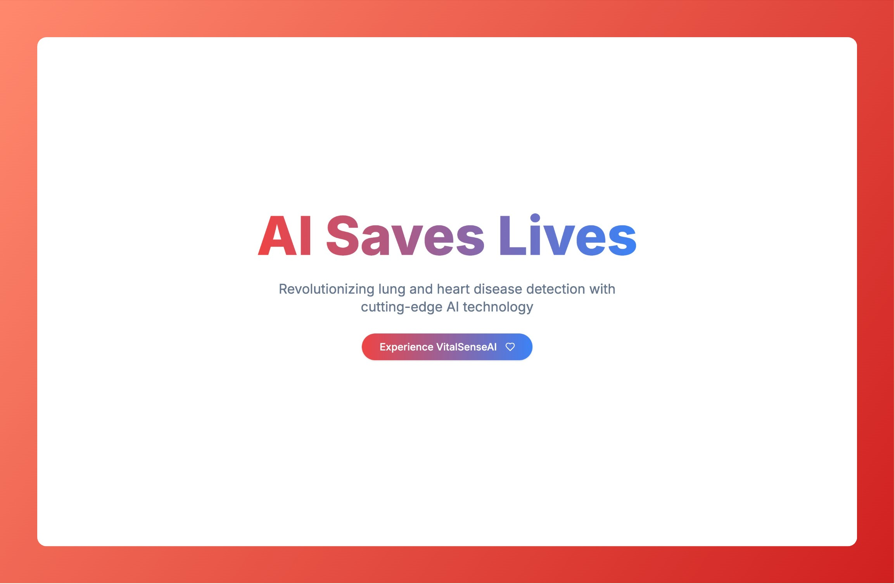
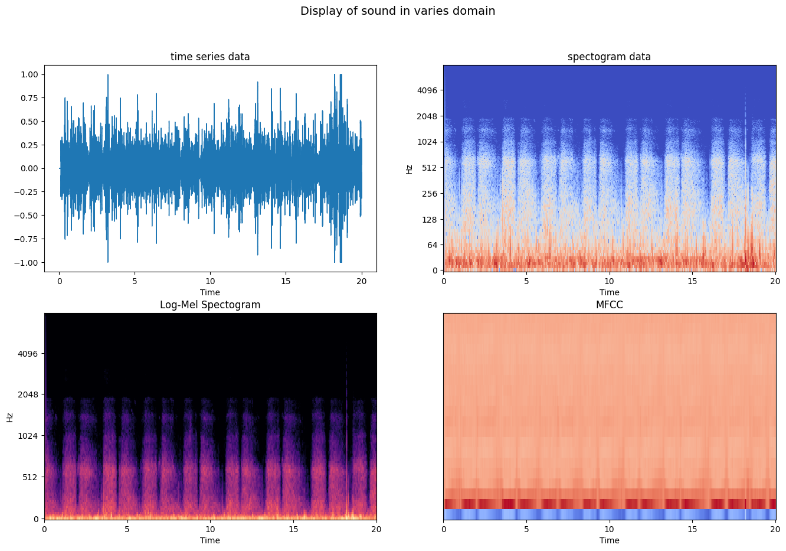
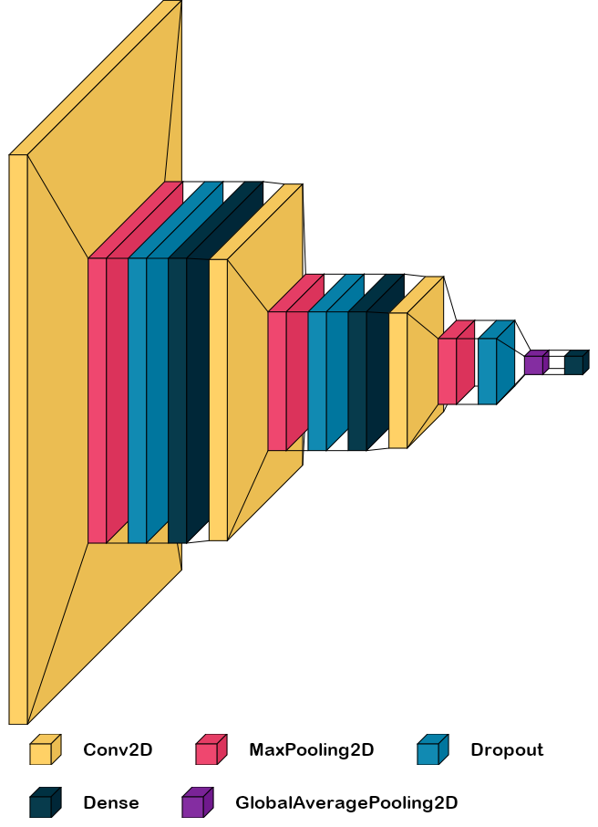

# 🫁 VitalSenseAI 

> **AI-Powered Lung and Heart Disease Detection**

## Table of Contents

- [Project Overview](#project-overview)
- [Quick Start](#quick-start)
- [About the Project](#about-the-project)
- [Technical Approach](#technical-approach)
  - [Data & Preprocessing](#1-data--preprocessing)
  - [Audio Feature Extraction & Representation](#2-audio-feature-extraction--representation)
  - [Model Architecture](#3-model-architecture)
  - [Deployment](#4-deployment)
- [Performance Metrics](#performance-metrics)
- [Usage Examples](#usage-examples)
- [Dataset Reference](#dataset-reference)
- [CI/CD & Testing](#cicd--testing)
- [Challenges & Limitations](#challenges--limitations)
- [Learning Outcomes](#learning-outcomes)
 
## Project Overview

VitalSenseAI is an advanced AI system designed to detect lung diseases from respiratory sounds, leveraging the power of deep learning. This repository contains the core machine learning models and codebase for the project, which aims to enable early and accurate detection of critical lung conditions using recordings from electronic stethoscopes. 

## Quick Start
- [**Try the Web Demo**](https://vital-sense-ai.vercel.app/)
- [**Web Demo Github Repository**](https://github.com/jiveshkalra/vital-sense-ai)
- [**HuggingFace Space**](https://huggingface.co/spaces/jiveshkalra/LungDiseaseDetector)

## About the Project

This repository contains the core AI models and code for [VitalSenseAI](https://github.com/jiveshkalra/vital-sense-ai), a project aimed at helping people detect lung diseases from respiratory sounds. The models analyze audio recordings of lung sounds, captured via electronic stethoscopes, and predict the presence of major lung diseases. My goal is to provide a useful tool that can assist in the early detection of:

- **Bronchiectasis**
- **Chronic Obstructive Pulmonary Disease (COPD)**
- **Pneumonia**
- **Upper Respiratory Tract Infection (URTI)** 

## Technical Approach

### 1. Data & Preprocessing
* **Dataset**: We used the [ICBHI Respiratory Sound Database](https://www.kaggle.com/datasets/vbookshelf/respiratory-sound-database), which contains thousands of annotated lung sound recordings.
* **Challenge**: The dataset is highly imbalanced, with some diseases underrepresented. We addressed this using techniques like minority upsampling using RandomOverSampler from `imblearn`.
* **Audio Preprocessing**:
  - All audio is resampled to 16kHz and padded/truncated to a fixed length for consistency.
  - We experimented with multiple feature extraction methods to best represent lung sounds for AI analysis.

### 2. Audio Feature Extraction & Representation

To prepare the audio data for AI analysis, we experimented with several feature extraction techniques to best capture the characteristics of lung sounds:
* **Raw Waveform (Time Series)**
* **Spectrograms**
* **MFCC (Mel-Frequency Cepstral Coefficients)**
* **Log-Mel Spectrograms**

*Figure: Visualization of a lung sound sample in different audio feature domains—raw waveform, spectrogram, MFCC, and Log-Mel spectrogram.*

**Outcome**: Among these, Log-Mel spectrograms consistently delivered the highest accuracy (over 90%) on both training and testing datasets, making them the preferred input representation for our models.

### 3. Model Architecture

**Convolutional Neural Networks (CNNs)**
  - Designed and trained custom CNN architectures to classify lung sounds.
  - Multiple models were trained with different input encodings (MFCC, Log-Mel, etc.).
  - The best-performing model uses Log-Mel spectrograms as input.
  

    
  

*Figure: Architecture of the custom Convolutional Neural Network (CNN) used for classifying lung diseases from Log-Mel spectrogram representations of respiratory sounds.*

### 4. Deployment

**Gradio Interface**
  - An interactive web interface is provided for easy testing and demonstration.
  - Users can upload or record audio and receive instant predictions.
**HuggingFace Spaces**
  - The model is deployed on HuggingFace Spaces for public access.
  - [Try it out here!](https://huggingface.co/spaces/jiveshkalra/LungDiseaseDetector)

## Challenges & Limitations 

1. **Imbalanced Dataset:**
   - The original dataset had significant class imbalance. While RandomOverSampler improved results, a more balanced dataset from the start would likely yield even better performance. 

2. **Hardware Accessibility:**
   - The current system requires electronic stethoscopes, which are expensive and not widely available, especially in low-resource settings. We aim to adapt our models for use with more affordable and accessible recording devices in the future, making lung health screening possible at home.  

## Learning Outcomes

This project has been a tremendous learning journey, including:
- **Deep Learning for Audio:** Gained hands-on experience in applying CNNs to audio classification problems.
- **Feature Engineering:** Explored and compared various audio feature extraction techniques.
- **Model Deployment:** Learned to deploy models using Gradio and HuggingFace Spaces, making AI accessible to non-technical users.
- **Research & Problem Solving:** Tackled real-world challenges like data imbalance, hardware limitations, and the nuances of medical data.
- **End-to-End AI Product Development:** From data preprocessing to model training, evaluation, and deployment.

---

  <b>Built With ❤️ by Jivesh Kalra</b>

